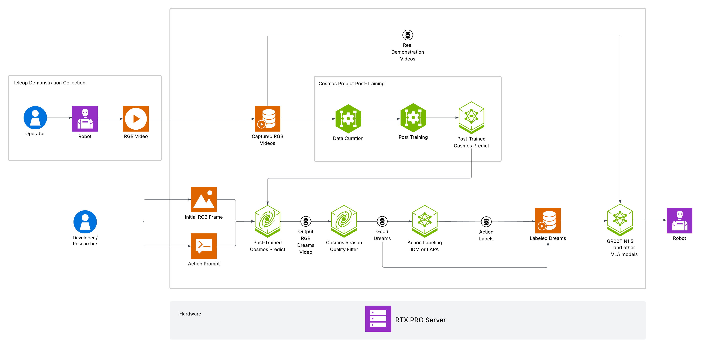

# NVIDIA RTX Pro for GR00T-Dreams

The NVIDIA Isaac GR00T-Dreams workflow generates vast amounts of synthetic video data using NVIDIA Cosmos world foundation models (WFMs) and extracts action data from these videos (and real-world videos) using techniques like [LAPA](https://latentactionpretraining.github.io/) and [IDM](https://openai.com/index/vpt/). First, synthetic video data is generated using Cosmos, prompted by a single image and language instructions. Next, action data is extracted from these videos using LAPA and IDM. This action data extraction process can be applied to any video data, generated from different WFMs. This enables robots to learn new tasks in unfamiliar environments without needing specific teleoperation data.

## Bill of Materials

### Recommended

| **System Specifications for RTX Pro Server** |                                         |
|----------------------------------------------|-----------------------------------------|
| **RTX PRO SERVER**                          | 8x RTX PRO 6000 Blackwell Server Edition GPUs 800 GB GPU Memory  |
| **Virtualization**                          | VMware RedHat                                 |
| **Storage**                                 | Scalable / Interoperable / Secure       |

### Center of Excellence

| **System Specifications for NVIDIA DGX B300**            |                                               |
|---------------------|-----------------------------------------------------------|
| **NVIDIA DGX B300** | NVIDIA Blackwell Ultra GPUs 2.3 TB GPU Memory          |
| **Virtualization**  | VMware RedHat                                          |
| **Storage**         | Scalable / Interoperable / Secure                         |
